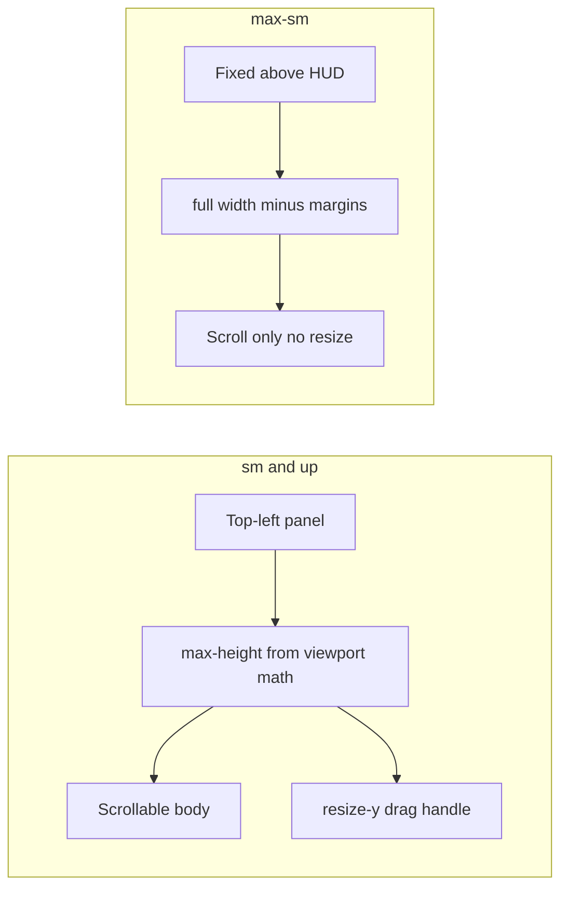

# Fix explainer overlay scroll and small-screen layout

## Problem

The explainer is rendered in [`components/ui/TopLeftControls.tsx`](components/ui/TopLeftControls.tsx) as a `<section>` with **no height cap or overflow**. It grows downward from a fixed top-left `<aside>` while [`app/page.tsx`](app/page.tsx) and [`app/layout.tsx`](app/layout.tsx) set `overflow-hidden` on `main`/`body`, so content below the fold is clipped with no way to scroll.

```142:147:components/ui/TopLeftControls.tsx
        <section
          className="mt-1 relative w-[min(23rem,calc(100vw-1.5rem))] rounded-2xl border ...
            backdrop-blur-md sm:p-5"
```

The bottom [`components/hud/HUD.tsx`](components/hud/HUD.tsx) (`fixed bottom-0`, ~120–180px) further reduces usable vertical space. Solstice copy (misconception paragraph) makes the panel especially tall.

## Approach

Combine three techniques (user chose scroll + vertical resize + mobile handling):



### 1. Publish HUD height as a CSS variable + custom event

In [`components/hud/HUD.tsx`](components/hud/HUD.tsx):

- Add `data-hud-root` ref via `useRef<HTMLDivElement>` on the root container for measurement.
- On mount, attach a `ResizeObserver` that writes `--hud-height` (px) to `document.documentElement` **and dispatches a custom event**:

```tsx
// HUD.tsx — inside useEffect
const rootEl = hudRef.current
if (!rootEl) return
const update = () => {
  const h = rootEl.clientHeight
  document.documentElement.style.setProperty('--hud-height', `${h}px`)
  document.dispatchEvent(new CustomEvent('solar:hud-height', { detail: h }))
}
observer = new ResizeObserver(update)
observer.observe(rootEl, { box: 'content-box' })
update() // initial read
return () => observer?.disconnect()
```

- Clean up observer on unmount.

**In [`components/ui/TopLeftControls.tsx`](components/ui/TopLeftControls.tsx)**, consume via a lightweight listener (not just CSS variable reads) to avoid stale closure bugs from excessive React re-renders:

```tsx
// TopLeftControls.tsx — new hook or inline effect
useEffect(() => {
  const onHudHeight = () => recalcMaxHeight()
  document.addEventListener('solar:hud-height', onHudHeight)
  return () => document.removeEventListener('solar:hud-height', onHudHeight)
}, [panelRef])
```

This decouples HUD resize from TopLeftControls re-renders and prevents `ResizeObserver`-induced thrash.

### 2. Restructure the explainer panel into header / scroll body / footer

In [`components/ui/TopLeftControls.tsx`](components/ui/TopLeftControls.tsx), change the `<section>` to a flex column:

| Region            | Content                                                    | Classes                                                                               |
| ----------------- | ---------------------------------------------------------- | ------------------------------------------------------------------------------------- |
| Header (fixed)    | Event pills (June/December etc.) + close button            | `shrink-0`                                                                            |
| Body (scrollable) | Date, title, summary, 3 steps, axis callout, misconception | `overflow-y-auto overscroll-y-contain min-h-0 flex-1` + class `season-explainer-body` |
| Footer (fixed)    | Compare + Close buttons                                    | `shrink-0` with top border/padding                                                    |

This keeps primary actions visible without scrolling to the bottom.

### 3. Constrain height with viewport-aware math

Add a small hook or inline `useLayoutEffect` in `TopLeftControls`:

- Listen to `resize`, `visualViewport` resize/scroll (mobile browser chrome), and HUD height changes.
- When the panel is open, compute:

  `available = visualViewport.height - sectionTop - var(--hud-height) - safeAreaBottom - 8px gap`

- Apply `style={{ maxHeight: available }}` on the `<section>` (with `Math.max(160, available)` floor).
- On desktop, also set a sensible default height (~`min(available, 28rem)`) so resize starts from a comfortable size.

Use `100dvh` / `visualViewport.height` rather than `window.innerHeight` so mobile Safari toolbar changes are handled.

### 4. Vertical resize via custom pointer-event drag handle (desktop only)

**Do not use CSS `resize-y` — it is unsupported in Safari (macOS + iOS).** Build a custom drag handle:

- On `sm+` breakpoints, insert a `<div>` drag handle between the scroll body and footer:

```tsx
{/* Drag handle */}
<div
  className="hidden sm:flex justify-center cursor-row-resize py-1 hover:bg-white/5 transition-colors"
  style={{ touchAction: 'none' }}
  onPointerDown={(e) => startResize(e, panelRef)}
>
  <div className="w-8 h-1 rounded-full bg-white/20" />
</div>
```

- Track `onPointerMove` only while the handle is grabbed. Clamp to `minH: 12rem` / `maxH: computedMax`.
- Write directly to `panelRef.current.style.height` (not via React state) to avoid re-render thrash on every pointer move.
- On `pointerup`, detach global `pointermove`/`pointerup` listeners from `document`.

This works uniformly across desktop Safari, Chrome, Firefox — and avoids accidental mobile resize gestures since the handle is hidden on `max-sm`.

### 5. Mobile layout: drawer pattern with scrim (not just fixed positioning)

The plan's mobile strategy has a **z-ordering conflict**: both the trigger buttons (`z-50`) and the explainer panel (`z-50`) are `fixed`, so they overlap. On small screens, pressing "Solstice" would show the panel but the user couldn't access Close/Compare because the buttons are hidden underneath.

**Fix: implement a drawer pattern on `max-sm`:**

| Element | Classes |
|---------|---------|
| **Scrim overlay** | `fixed inset-0 bg-black/40 z-[55] sm:hidden` — dismisses on tap |
| **Panel** | `fixed inset-x-3 bottom-[calc(var(--hud-height,8rem)+0.75rem)] z-[60] rounded-t-2xl w-auto sm:relative sm:bottom-auto sm:left-auto sm:right-auto sm:z-50 sm:w-[min(23rem,calc(100vw-1.5rem))]` |
| **Trigger buttons (aside)** | `peer-open:opacity-0 peer-open:pointer-events-none` — hide when drawer is open |

Add the scrim as a sibling of the `<section>`, and toggle button visibility using a CSS peer pattern or conditional className based on `selectedEvent !== null`:

```tsx
{/* Scrim */}
{selectedEvent && (
  <div
    className="fixed inset-0 bg-black/40 z-[55] sm:hidden"
    onClick={closeExplainer}
    aria-hidden="true"
  />
)}

{/* Section with mobile drawer classes */}
<section
  className={`mt-1 relative ... ${
    selectedEvent ? 'inset-x-3 bottom-[calc(var(--hud-height,8rem)+0.75rem)] z-[60] rounded-t-2xl w-auto sm:relative sm:bottom-auto sm:left-auto sm:right-auto sm:z-50 sm:w-[min(23rem,calc(100vw-1.5rem))]' : ''
  }`}
>
```

This ensures the panel sits **above** both the aside buttons and the HUD on mobile, with a tappable scrim to dismiss.

### 6. Scrollbar styling

In [`app/globals.css`](app/globals.css), add `.season-explainer-body` rules:

- Thin scrollbar (`scrollbar-width: thin` + `::-webkit-scrollbar` at ~6px)
- Muted thumb color using existing explainer tokens
- Respect `prefers-reduced-motion` (no animated scroll behavior)

### 7. Accessibility

- Add `aria-label="Season explainer details"` on the scroll body region.
- Ensure tab order: header pills → scrollable content → footer buttons.
- No change to existing close/compare behavior or store logic.

## Files to change

| File                                                                     | Change                                                         |
| ------------------------------------------------------------------------ | -------------------------------------------------------------- |
| [`components/ui/TopLeftControls.tsx`](components/ui/TopLeftControls.tsx) | Panel structure, mobile positioning, max-height hook, resize-y |
| [`components/hud/HUD.tsx`](components/hud/HUD.tsx)                       | `--hud-height` CSS variable via ResizeObserver                 |
| [`app/globals.css`](app/globals.css)                                     | `.season-explainer-body` scrollbar styles                      |

## Verification

Manual checklist (no new automated tests — overlay layout is visual):

1. Desktop (~1280px): open Solstice → scroll body shows misconception text; footer buttons stay visible; drag resize handle changes height within bounds.
2. Phone viewport (~390px height): panel sits above timeline; all sections scrollable; no clipped text at bottom.
3. Rotate phone / resize window: panel max-height updates; no overlap with HUD.
4. Equinox mode: same behavior with shorter copy.
5. `pnpm lint` and `pnpm test` (existing suites unchanged).

## Out of scope

- Changing `overflow-hidden` on `body`/`main` (not needed once panel is self-contained).
- InfoModal scroll (separate centered dialog; shorter content today).
- Horizontal resize (not requested).
