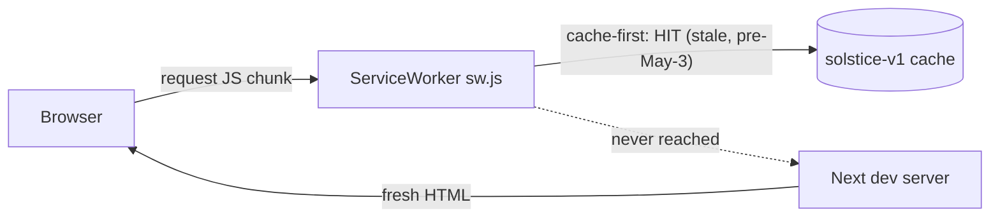

# Fix Stale Service Worker Caching

## Diagnosis (verified)

The browser at `localhost:3100` is executing JavaScript chunks and loading a texture cached by `public/sw.js` months ago:

- Client JS renders `aria-label="About SimSolar"` — a string removed in commit `d744777` (May 3) → hydration mismatch.
- The `threeLine` element exists in no current source file and no installed dependency → the crashing chunk is from an old build.
- Browser received a 21600×10800 `earth-day.jpg`; the file on disk is 16384×8192 → served from the `solstice-textures-v1` cache.

The architectural flaws: cache-first with no revalidation for dev chunks (which are not content-hashed), static cache names that are never versioned, and unconditional SW registration in development via [lib/useOfflineStatus.ts](lib/useOfflineStatus.ts).



## Changes

### 1. Never run the service worker in development — `lib/useOfflineStatus.ts`

In the registration effect: if `process.env.NODE_ENV !== 'production'`, **unregister** any existing registration and delete the app caches instead of registering. This is self-healing — your current broken state (and any other machine that visited the dev URL) recovers automatically on next load, no manual DevTools surgery needed.

```ts
if (process.env.NODE_ENV !== "production") {
  navigator.serviceWorker.getRegistrations().then((regs) => regs.forEach((r) => r.unregister()));
  // also caches.keys() -> delete solarsim/solstice caches
  return;
}
```

### 2. Version the caches and fix strategies — `public/sw.js`

- Bump and rename cache names: `solarsim-static-v1` and `solarsim-textures-v2` (purges all stale `solstice-*` entries via the existing `activate` cleanup, and aligns naming with the SolarSim rename). Add a comment: bump the texture cache version whenever texture files change.
- Restrict cache-first to truly immutable assets: keep it for `/_next/static/` (content-hashed in production builds) and `/textures/`, but **remove the blanket `\.(js|css|woff2...)$` regex** — that is what cached non-hashed scripts.
- Keep network-first for navigations (already correct).

### 3. Sync the coupled constants — `lib/useOfflineStatus.ts`

Update `TEXTURE_CACHE_NAME` to `solarsim-textures-v2` to match the SW (existing `// COUPLED` comments mark both sites).

### 4. Regression guard — small vitest test

Add `lib/__tests__/swCacheNames.test.ts` that reads `public/sw.js` and `lib/useOfflineStatus.ts` as text and asserts the texture cache names match, so the coupled constants can't silently drift.

## Not addressed (benign, noted for completeness)

- `THREE.Clock deprecated` warning comes from `@react-three/fiber` internals, not your code — upstream noise, ignore.
- `Texture resized to 16384x8192` after the fix simply reflects your GPU's max texture size; the on-disk 16384×8192 file already fits, so the warning disappears once the stale texture is purged.

## Verification

1. `pnpm test` — all tests pass including the new one.
2. Hard-reload `localhost:3100` twice (first load unregisters the SW, second runs clean) — confirm no hydration error, no ThreeLine crash, no 21600px texture warning, and the Moon orbit line renders.
3. Confirm offline caching still works in a production build (`pnpm build && pnpm start`, toggle "Make available offline", go offline, reload).
