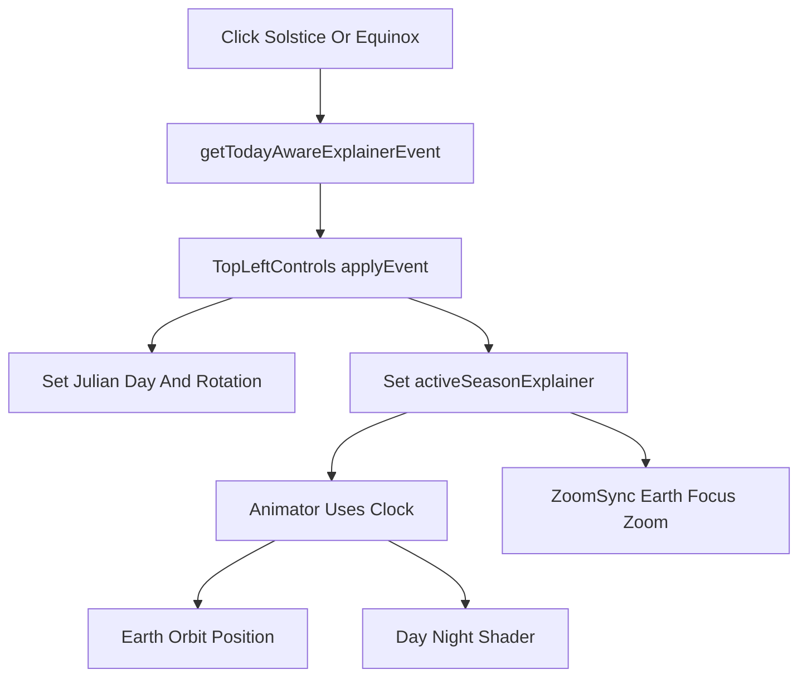
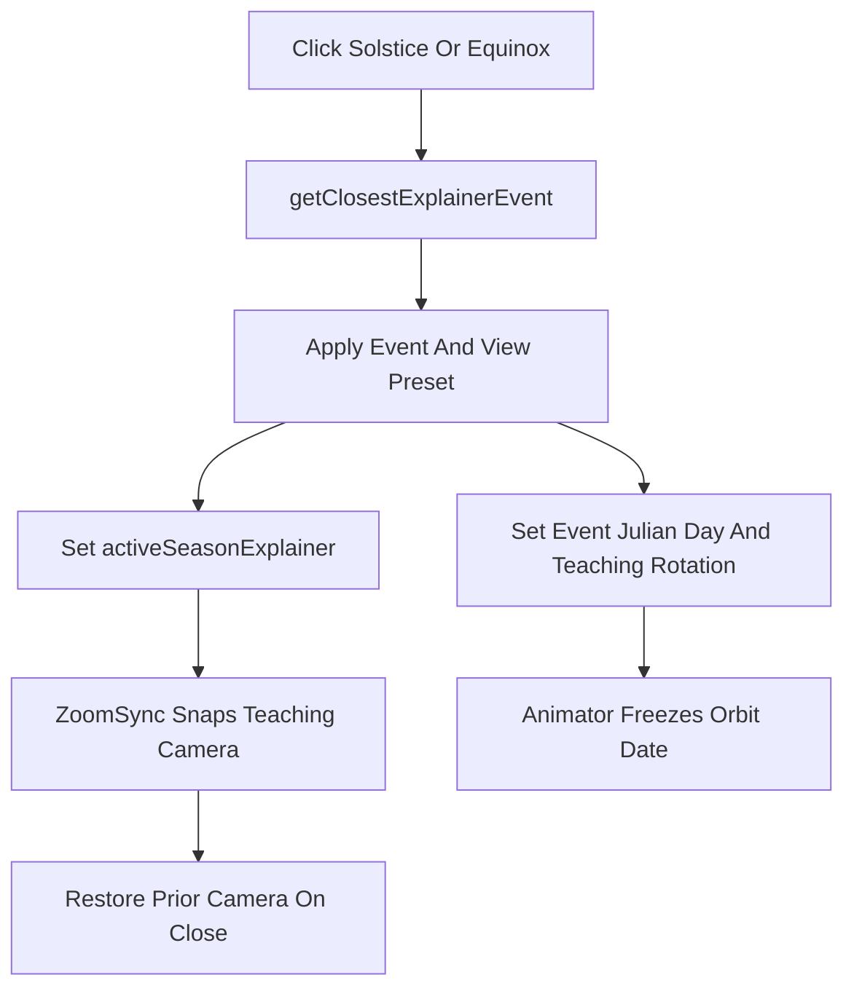

# Pedagogical Season Explainer Views

## Understanding

The current explainer chooses a mode event, sets `clock.julianDay` to that event date, switches to earth focus, and applies zoom/scale. It does not choose a teaching camera pose, and the initial globe rotation is sidereal rather than curated for the explanation.

Assumption for implementation: “closest” means the event with the smallest absolute day distance from today among previous/current/next year candidates for the selected mode. If exactly tied, prefer the upcoming event.

## Scope

Change only the season explainer selection/view pipeline:

- `[lib/seasonExplainer.ts](lib/seasonExplainer.ts)` — event selection and per-event view metadata.
- `[components/ui/TopLeftControls.tsx](components/ui/TopLeftControls.tsx)` — apply curated initial globe rotation and existing scene preset.
- `[components/canvas/ZoomSync.tsx](components/canvas/ZoomSync.tsx)` — snap/restore deterministic camera pose when explainer event changes.
- `[lib/cameraMath.ts](lib/cameraMath.ts)` — pure helper for explainer camera positions.
- Tests in `[__tests__/seasonExplainer.test.ts](__tests__/seasonExplainer.test.ts)` and `[__tests__/cameraMath.test.ts](__tests__/cameraMath.test.ts)`.

No changes to `getEarthOrbitalPosition()`, Earth shaders, or the fixed axial tilt model.

## Current Flow



## Planned Flow



## Implementation Plan

1. Replace today-aware event picking with closest-event picking in `[lib/seasonExplainer.ts](lib/seasonExplainer.ts)`.
   - Keep the public function name `getTodayAwareExplainerEvent()` unless a rename is worth the churn.
   - Internally compute candidates for `baseYear - 1`, `baseYear`, and `baseYear + 1`.
   - Choose the candidate with smallest `Math.abs(event.jd - todayJD)`.
   - Tie-break toward future/current events, then earliest date.
   - Update tests that currently expect “next upcoming after recent window”; those should expect nearest absolute event.

2. Add event-level teaching view metadata in `[lib/seasonExplainer.ts](lib/seasonExplainer.ts)`.
   - Extend the explainer model with a small view preset, for example:

```ts
export interface SeasonExplainerViewPreset {
  rotationAngle: number;
  cameraKind: "solstice-north-lit" | "solstice-south-lit" | "equinox-side";
}
```

- Return the preset from `getSeasonExplainerEvent()` so `TopLeftControls` and `ZoomSync` can consume one source of truth.
- Use deterministic rotation angles per event so the same event opens with the same continental/terminator view every time.
- Preserve the existing behavior that user `rotationSpeed` is not overwritten; the view starts fixed, then the globe may continue rotating if the user speed is non-zero.

3. Apply the teaching rotation in `[components/ui/TopLeftControls.tsx](components/ui/TopLeftControls.tsx)`.
   - Replace `clock.rotationAngle = getSiderealRotationAngle(event.jd)` with the event’s `viewPreset.rotationAngle`.
   - Keep snapshot/restore exactly as today, so Close returns to the user’s prior date and rotation.
   - Keep `SEASON_EXPLAINER_SCENE_PRESET` for `isPlaying`, `orbitSpeed`, `focusTarget`, `zoomDistance`, and `earthScale`.

4. Add pure camera helper(s) in `[lib/cameraMath.ts](lib/cameraMath.ts)`.
   - Add a helper such as `getSeasonExplainerCameraPosition(eventLabel, earthPosition, distance)`.
   - For solstices, choose a three-quarter geocentric camera vector that keeps the tilted axis and day/night boundary visible.
   - For equinoxes, choose a side-on camera vector that makes the terminator and both poles easier to read.
   - Base the helper on `earthPosition` so it remains consistent with the existing Keplerian orbit and geocentric reference frame.
   - Add unit tests for distance preservation, deterministic output, and distinct solstice/equinox view directions.

5. Snap camera on explainer entry/change in `[components/canvas/ZoomSync.tsx](components/canvas/ZoomSync.tsx)`.
   - Read `activeSeasonExplainer` in the existing `useFrame` loop.
   - Use `SimulationContext` to get the current event `julianDay`, compute `earthPosition`, and derive the preset camera position.
   - When transitioning from no explainer to explainer, snapshot `camera.position` and `controls.target` in refs.
   - When the event label changes, snap to the new event’s teaching camera pose and call `controls.update()`.
   - When `activeSeasonExplainer` clears, restore the prior camera position/target if a snapshot exists.
   - Continue to respect `zoomDistance` through the existing `zoomToDistance()` path.

6. Keep manual user control after the snap.
   - Do not lock OrbitControls.
   - If the user rotates or pans during the explainer, allow it.
   - Re-snap only when the active event label changes, not every frame.

7. Update tests.
   - `[__tests__/seasonExplainer.test.ts](__tests__/seasonExplainer.test.ts)`:
     - Verify closest solstice before and after June selects June until December becomes closer.
     - Verify closest equinox selects March/September by absolute date.
     - Verify each event exposes a view preset.
   - `[__tests__/cameraMath.test.ts](__tests__/cameraMath.test.ts)`:
     - Verify explainer camera helper returns finite coordinates at the requested distance.
     - Verify solstice and equinox camera vectors differ.
     - Verify outputs are stable for the same event and Earth position.

## Risks

- The exact teaching rotation angles will be visual choices. They should be tuned manually after the first implementation pass.
- Restoring camera state in `ZoomSync` must not fight the existing zoom synchronization logic.
- Tests can validate determinism and selection logic, but the actual pedagogy still needs manual visual review.

## Verification

Run:

```bash
pnpm lint
pnpm test
```

Manual review:

1. On today’s date, Solstice opens the nearest June/December solstice, not always December.
2. On today’s date, Equinox opens the nearest March/September equinox.
3. Solstice starts with the relevant pole/sun relationship clearly visible.
4. Equinox starts with a side-on view where daylight balance is clearer.
5. Switching event pills snaps to that event’s teaching view.
6. Closing the explainer restores the user’s prior camera orientation and scene state.
7. User camera controls still work after the initial snap.
